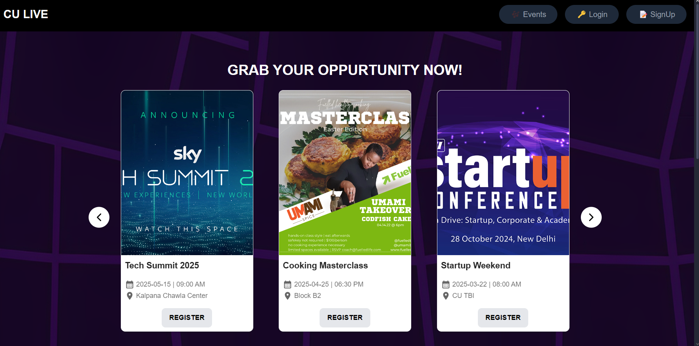
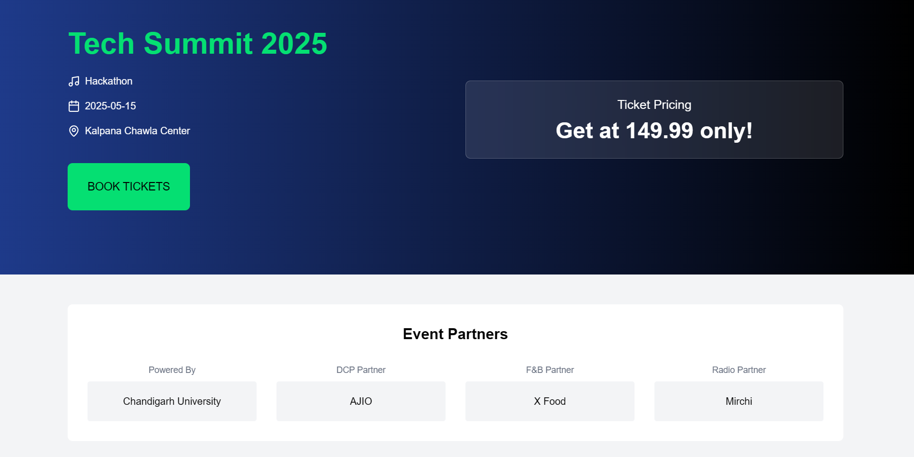
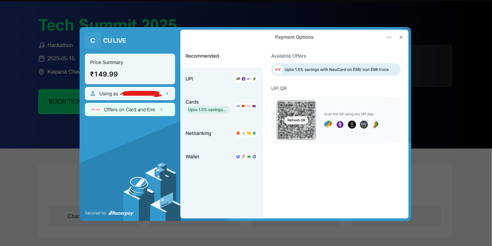
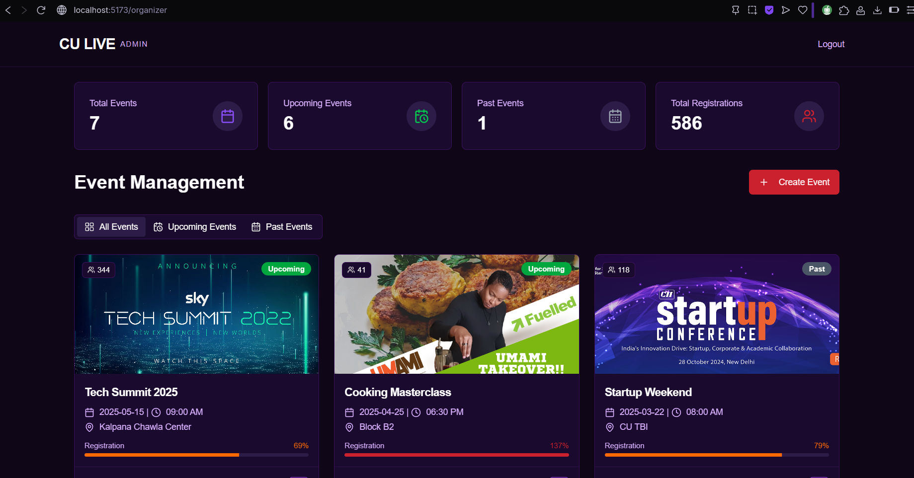
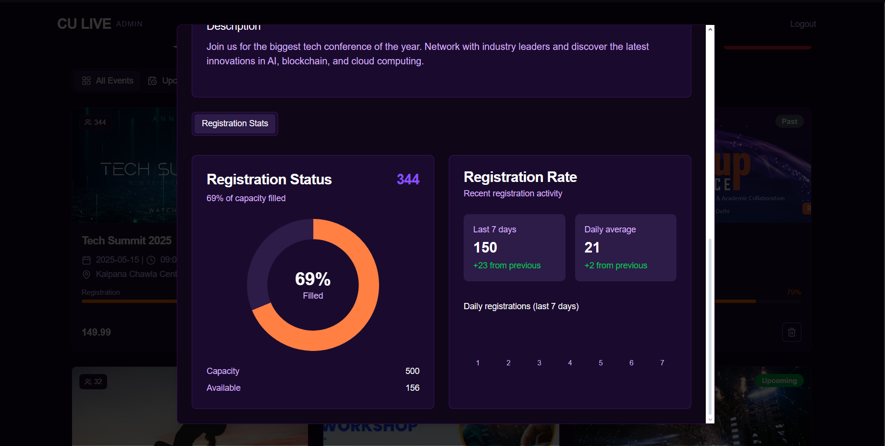

# 🎉 CU LIVE – Event Management Platform for Chandigarh University

**CU LIVE** is a full-stack event management platform built specifically for Chandigarh University. It enables students to explore and register for university events with ease, while providing powerful tools to admins for event management, analytics, and payment handling.

---

## ✨ Features

### 👩‍🎓 For Students
- Discover and browse upcoming CU events
- Register for events with a few clicks
- Secure online payments via Razorpay
- Instant email ticket confirmation

### 🛠️ For Admins
- Create, update, and delete events
- Track registrations and payments
- View event analytics and engagement stats
- Manage user access and event visibility

---

## 🛠 Tech Stack

### Backend
- **Node.js** & **Express.js** – REST API server
- **MongoDB** – NoSQL database
- **JWT Authentication** – Secure login/session handling
- **Razorpay** – Payment gateway integration
- **SendGrid (Twilio)** – Email notifications with ticket delivery

### Frontend
- **React.js** – Frontend library
- **Tailwind CSS** – Utility-first CSS framework
- **Material UI (MUI)** – Component library
- **React Router** – SPA routing
- **Axios** – API integration

---

## 📁 Project Structure

```
CU-LIVE/
├── frontend/               # React frontend
│   ├── public/
│   ├── src/
|   |   |── Admin/
│   │   ├── components/
│   │   ├── pages/
│   │   ├── api/
|   |   |── context/
|   |   |── lib/
|   |   |── hooks/
|   |   |── User/
│   │   └── App.jsx
├── backend/               # Node.js backend
│   ├── init/
│   ├── models/
│   ├── schemas/
│   ├── utils/
│   ├── index.js
│   └── razorpay.js
├── .env
├── package.json
└── README.md
```

---

## 📷 Screenshots






## 🚀 Getting Started

### 1. Clone the Repository

```bash
git clone https://github.com/Mansi-Narang/CU_LIVE.git
cd 
```

### 2. Configure Environment Variables

Create a `.env` file inside the `backend/` folder with the following:

```env
PORT=5000
MONGODB_URL=your_mongodb_connection_string
JWT_TOKEN=your_jwt_secret
RAZORPAY_KEY_ID=your_razorpay_key_id
MAILER_KEY=Sendgrid_mailer_key
UNIVERSITY_MAIL_DOMAIN=cuchd.in
RAZORPAY_KEY_SECRET=your_razorpay_secret
SENDER_MAIL=Sendgrid_mailer_verified_sender
SECRET=cookie_secret
```

### 3. Install Dependencies

#### Backend
```bash
cd backend
npm install
```

#### Frontend
```bash
cd ../frontend
npm install
```

### 4. Run the Application

```bash
# Start backend server
cd server
npm run dev

# Start frontend
cd ../client
npm start
```

Visit the app at: [http://localhost:3000](http://localhost:5173)

---

## 🔐 Admin Access

(Admin dashboard URL: `/admin`)

---

## 🤝 Contribution Guidelines

We welcome contributions! To contribute:

1. Fork the repository
2. Create a new branch (`git checkout -b feature-xyz`)
3. Make your changes and commit (`git commit -m "Add feature xyz"`)
4. Push to your fork (`git push origin feature-xyz`)
5. Open a Pull Request

---

## 🛡 Security Practices

- Passwords encrypted using bcrypt
- JWT-based session management
- Sensitive data stored securely in `.env`
- Email and payment integrations are secured with API keys

---

## 📬 Contact

**Project Maintainers:** 

 - [Mansi-Narang](https://github.com/Mansi-Narang/)
 - [Punit9464](https://github.com/Punit9464/)
 - [Vansh Sharma](https://github.com/vanshshar/)

---

## 📄 License

This project is licensed under the MIT License.

---

> Built with ❤️ to make campus events smarter and more accessible at Chandigarh University.

#### NOTE: This Project is not official by Chandigarh University yet. This project idea came out of an academic event, at Chandigarh University.
